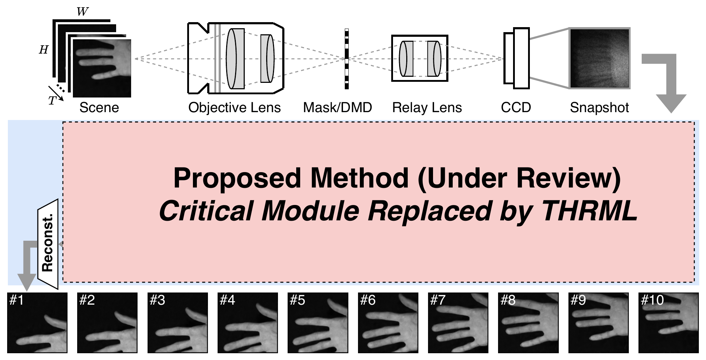
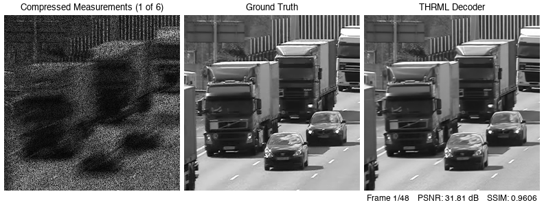

# EYERIS — Energy-Efficient High-Speed Camera (preview)

> [!IMPORTANT]
> This repository was created for **Extropic's Hackathon**, where each team
> (1–4 members) had 4 hours to showcase an application of thermodynamic
> hardware using Extropic's THRML emulator. Given the short 4-hour window,
> the results and analysis are necessarily preliminary. **This project won first place**.

High-speed frames are modulated by binary masks and summed into a **single
coded measurement** `y = Σ_t M_t ⊙ x_t` (compression ratio 8:1); a learned
decoder recovers the frames. Here the decoder's critical module is replaced
by Extropic's `thrml` thermodynamic block-Gibbs sampler — an inference-only
swap with frozen weights.

## Overall architecture



`T` high-speed frames are optically modulated by a binary mask (DMD) and
integrated on the CCD into a single snapshot measurement; the proposed decoder
reconstructs the frames, with its critical module replaced by THRML.

## Result preview



**Left:** the actual decoder input — the first of the sequence's six coded
measurements, each encoding 8 video frames (computed with the same digital
Bernoulli mask used in the evaluation). **Middle:** ground truth. **Right:**
frames recovered by the thrml-decoder pipeline. On this `traffic` sequence the thermodynamic decoder reaches
32.43 dB / 0.969 SSIM vs the decoder's 32.72 dB / 0.971 — a −0.29 dB cost
for the thermodynamic replacement.

> **Note:** The original model is currently under review, so its code is not
> uploaded here. This directory shares only the results obtained by replacing
> the model's critical module with `thrml`.

## Citation

```bibtex
@misc{hong2026thrml,
  author       = {Seungki Hong},
  title        = {Applications of Thermodynamic Computing with Extropic THRML},
  year         = {2026},
  publisher    = {GitHub},
  howpublished = {\url{https://github.com/skethz/extropic-thrml-applications}},
}
```
