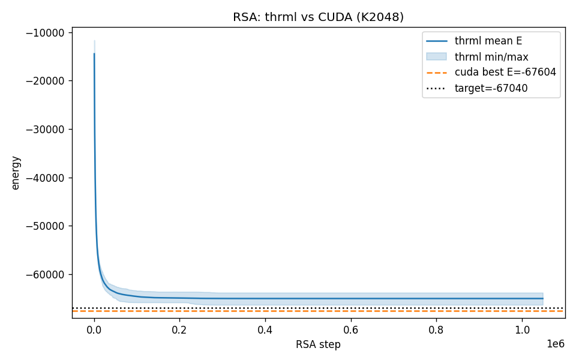
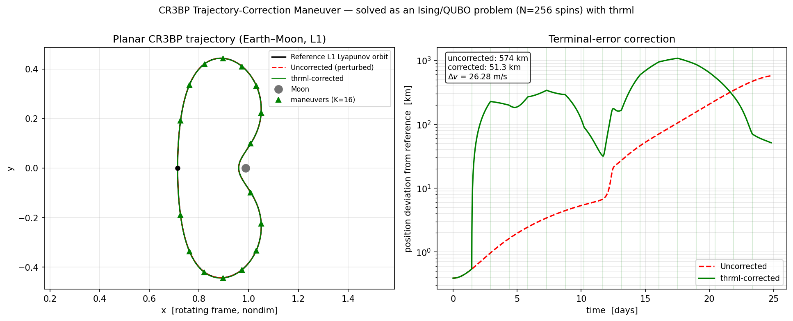

# Applications of Probabilistic and Thermodynamic Computing with Extropic THRML

> [!IMPORTANT]
> This repository was created for **Extropic's Hackathon**, where each team
> (1–4 members) had 4 hours to showcase an application of thermodynamic
> hardware using Extropic's THRML emulator. Given the short 4-hour window,
> the results and analysis are necessarily preliminary. **This project won first place**.

Case studies porting hand-written CUDA Ising solvers to
[Extropic's `thrml`](https://github.com/extropic-ai/thrml) thermodynamic
sampling library (JAX, CPU): combinatorial optimization, spacecraft trajectory
correction, high-speed imaging, and single-image super-resolution. In each
case the *same* problem instance,
energy convention, and annealing schedule are kept, and only the solver is
swapped — the goal is to show that a thermodynamic block-Gibbs / heat-bath
sampler reproduces (or beats) the dedicated GPU kernel's solution quality.

> The hand-written CUDA kernels (`*.cu`, compiled `.so` libraries, GPU
> binaries) are **not** included in this repository — only the thrml/JAX side
> is published. CUDA numbers quoted in the per-project READMEs were produced
> on the original GH200 machine.

## Projects

### [`COP/`](COP/) — Combinatorial Optimization: K2048 Max-Cut spin glass

Ground-state search for a fully-connected Ising spin glass (complete graph
K2048, random ±1 couplings) with RSA (random-sequential single-site heat-bath
annealing).

- **Bit-faithful JAX port:** reproduces the CUDA kernel's fixed-point dynamics
  *exactly* — all 32 replicas hit identical per-replica solution steps
  (avg_hit_steps matches to the decimal), i.e. step-axis TTS(0.99) is
  identical (37.79 ms equivalent).
- **thrml-native float sampler:** same algorithm via `SpinGibbsConditional`,
  statistically close but slightly worse at this rare-event operating point;
  the gap is fully explained by the float-vs-fixed-point arithmetic and is
  closed to zero by the bit-faithful port.



### [`CR3BP/`](CR3BP/) — Spacecraft Trajectory Correction Maneuver (TCM)

Planar Lyapunov orbit about the Earth–Moon L1 Lagrange point (circular
restricted three-body problem; reference orbit from NASA JPL's Poincaré
catalog). The linearized targeting problem — 16 impulsive Δv maneuvers, 8 bits
per component — becomes a fully-connected 256-spin QUBO solved by thrml
single-site heat-bath annealing.

- 10/10 successful attempts (p_attempt = 1.0), TTS@0.99 ≈ 182 s on CPU.
- A 0.38 km initial perturbation that would grow to a **573 km** terminal
  error is cut to **~51 km** with 26.3 m/s total Δv.



### [`EYERIS/`](EYERIS/) — Energy-Efficient High-Speed Camera (preview)

High-speed frames compressed into coded measurements (8:1), decoded with the
decoder's critical module replaced by thrml block-Gibbs (inference-only,
frozen weights; −0.29 dB on the `traffic` sequence shown). Results only — the
original model is under review, so its code is not uploaded.


### [`SISR/`](SISR/) — Single-Image Super-Resolution

Sparse-coding SR where each image patch poses a dense 64-spin Ising problem
(dictionary-atom selection); thrml block-Gibbs at low temperature is `vmap`-ed
over all patches of an image.

| solver      | per-patch Hamiltonian | % of ground state | PSNR (dB) |
|-------------|-----------------------|-------------------|-----------|
| CUDA greedy | -5.79e-3              | 69%               | 23.95     |
| **thrml**   | **-7.0823e-3**        | **97%**           | **24.27 (+0.32)** |

The finite-temperature sampler escapes the local minima that trap the
zero-temperature greedy kernel, yielding visibly better reconstructions on
Set5/Urban100.


## Environment

All projects share the same stack (per-project `requirements.txt`):

```
thrml 0.1.3 · jax 0.10.1 · numpy 2.4.6
```

plus `dimod`/`scipy` (CR3BP), `opencv`/`scikit-image` (SISR), and
`matplotlib`. Each subdirectory has its own README with method details,
results, and run instructions.

## Author

Seungki Hong — ETH Zürich, D-ITET.

## Citation

```bibtex
@misc{hong2026thrml,
  author       = {Seungki Hong},
  title        = {Applications of Thermodynamic Computing with Extropic THRML},
  year         = {2026},
  publisher    = {GitHub},
  howpublished = {\url{https://github.com/skethz/extropic-thrml-applications}},
}
```

## License

Licensed under the [Apache License, Version 2.0](LICENSE).
