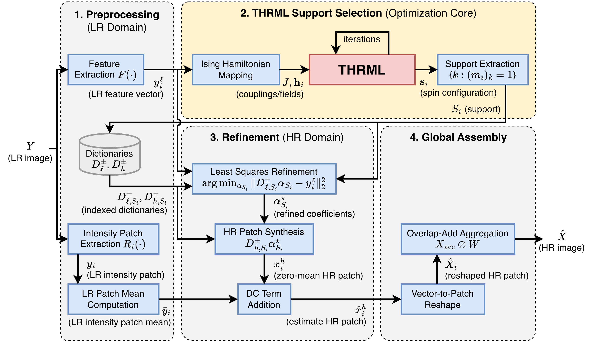
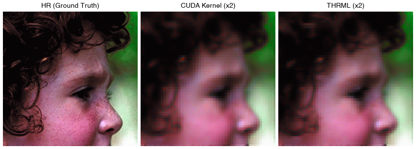

# Sparse-Coding Single-Image Super-Resolution on Extropic `thrml`

> [!IMPORTANT]
> This repository was created for **Extropic's Hackathon**, where each team
> (1–4 members) had 4 hours to showcase an application of thermodynamic
> hardware using Extropic's THRML emulator. Given the short 4-hour window,
> the results and analysis are necessarily preliminary. **This project won first place**.

Single-image super-resolution (SISR) by sparse coding, where the per-patch
dictionary-atom selection is posed as an **Ising Hamiltonian minimization** and
solved with [Extropic's `thrml`](https://github.com/extropic-ai/thrml)
thermodynamic block-Gibbs sampler (CPU/JAX) instead of a hand-written CUDA
greedy kernel.

> **Note:** This repository contains only the thrml side of the work. The CUDA
> kernel (`ising_int_thrml.cu` / `libising_int_thrml.so`) used for the GPU
> baseline and for the final patch-overlap reconstruction is not included, so
> `run_thrml_all.py` is published as a record of the exact experiment driver
> rather than a turnkey script. The thrml solver itself (`thrml_solver.py`) is
> fully standalone. Benchmark datasets (Set5, Urban100) are not included.

## Overall architecture



Each LR patch is featurized and mapped to an Ising Hamiltonian (couplings
**J**, fields **h**); THRML's block-Gibbs sampler selects the sparse support
S_i, which a least-squares refinement turns into coefficients for HR patch
synthesis; overlap-add aggregation assembles the final HR image.

## Method

For each HR/LR patch pair we assume a shared sparse code over a learned
dictionary pair (D_l, D_h). Restricting each coefficient to {0, μ} via binary
variables turns the reconstruction loss into a QUBO, i.e. an Ising problem over
N = 64 spins per patch:

- **J** (couplings): from the Gram matrix of the augmented LR dictionary —
  one dense matrix shared by *all* patches of an image.
- **h** (biases): per patch, from how well each dictionary atom matches it.

`thrml_solver.py` expresses this as a `thrml.models.IsingEBM` on a complete
graph of 64 `SpinNode`s with singleton blocks (a complete graph admits no
smaller chromatic partition) and runs block-Gibbs at large β (β = 2000), which
turns the sampler into an optimizer. The per-patch bias is handled by
`jax.vmap`-ing one compiled solve over the whole batch of patches.

## Results (vs the CUDA greedy kernel, same architecture/algorithm)



Solution quality — the thermodynamic sampler gets much closer to the true
ground state of the per-patch Hamiltonian than the zero-temperature greedy
CUDA kernel, and that shows up in PSNR:

| solver        | Hamiltonian (Set5 patch ref.) | fraction of ground state | PSNR (dB) |
|---------------|-------------------------------|--------------------------|-----------|
| ground truth  | -7.091e-3                     | 100% (ref.)              | —         |
| CUDA kernel   | -5.79e-3                      | 69%                      | 23.95     |
| **thrml**     | **-7.0823e-3**                | **97%**                  | **24.27 (+0.32)** |

Throughput (avg. per-image solve time; thrml on CPU JAX, CUDA on GH200):

| dataset       | thrml (CPU) | CUDA (GH200) |
|---------------|-------------|--------------|
| Set5 ×2       | 6.50 s      | 0.008 s      |
| Urban100 ×2   | 6.68 s      | 0.006 s      |

Full per-dataset summaries and sample outputs are in `results/`
(`thrml_Set5_X2/` is complete; `thrml_Urban100/` holds samples plus the
`summary.txt` for all 100 images; `gpu_*_summary.txt` are the CUDA-baseline
timing summaries kept for reference).

## Files

- `thrml_solver.py`     — `ThrmlIsingSolver`: drop-in thrml replacement for the
                          GPU `solve_batch` kernel (standalone, no CUDA needed)
- `run_thrml_all.py`    — Set5/Urban100 ×2/×4 experiment driver (gpu vs thrml)
- `benchmark_thrml.py`  — single-image energy-parity check + CPU throughput
- `quick_psnr.py`       — Y-channel PSNR/SSIM scoring of result images
- `diag.py`             — spin/energy diagnostics: why thrml beats greedy CUDA
- `dictionaries_x{2,4}_32_bicubic/` — learned LR/HR dictionary pairs
                          (32 atoms → N = 64 augmented spins)
- `results/`            — output images and timing summaries

## Environment

```
pip install -r requirements.txt
```

The driver scripts were run in-place on the original machine and contain
hardcoded paths (`/scratch/hongse/ising`); adjust `ISING`, `BENCH_ROOT`, and
`LIB_PATH` at the top of each script to your layout.

## Citation

```bibtex
@misc{hong2026thrml,
  author       = {Seungki Hong},
  title        = {Applications of Thermodynamic Computing with Extropic THRML},
  year         = {2026},
  publisher    = {GitHub},
  howpublished = {\url{https://github.com/skethz/extropic-thrml-applications}},
}
```
